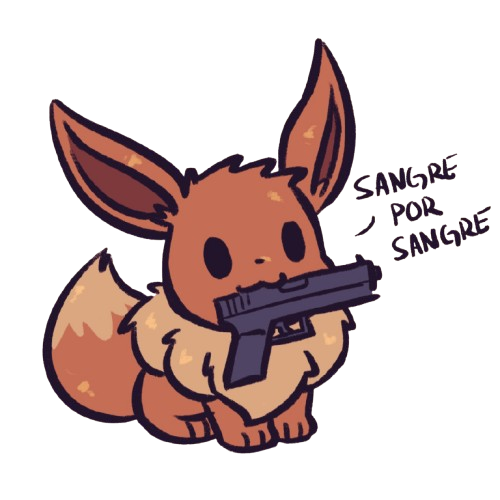

# Chào!

{:  style="display: block; margin: 0 auto; max-width:50%; height:auto;" }

Đây là trang sẽ hướng dẫn bạn cách tự học Tiếng Tây Ban Nha chuẩn.

[:fontawesome-solid-book-open: Đọc hướng dẫn ](guide.md){: .md-button .md-button--primary }  