# Một hướng dẫn đọc Tiếng Tây Ban Nha

## Vì sao nên đọc?

Khi tôi cầm trên tay cuốn tiểu thuyết tiếng Tây Ban Nha đầu tiên của mình, **El Cuaderno de Noah**, tôi suýt bỏ cuộc.
Tôi hiểu được vài mảnh nhỏ, nhưng phần còn lại giống như một mớ âm thanh vô nghĩa.

Dù vậy, tôi tự thỏa thuận với bản thân: mỗi tuần một chương, dù có khó đến đâu.
Chính hành động nhỏ đó đã thay đổi mọi thứ.

Sau vài tuần, não tôi ngừng việc dịch từng từ một.
Tôi bắt đầu _suy nghĩ_ bằng tiếng Tây Ban Nha, đoán trước ý nghĩa, nhận ra các mẫu câu.
Việc đọc huấn luyện tôi ở lại với ngôn ngữ, thay vì “đóng băng” khi không hiểu từng từ.

Đó là lý do tôi gọi việc đọc là _luyện tập vô hình_ giúp bạn trở nên trôi chảy. Và không chỉ riêng tôi nghĩ vậy: [các nghiên cứu cho thấy đọc trôi chảy trong ngôn ngữ bạn đang học giúp bạn tiến bộ nhanh hơn.](https://www.cambridge.org/core/journals/language-teaching/article/abs/classroombased-extensive-reading-a-review-of-recent-research/30D66954997FCF1236B077AED3D3D8C1)

Bạn có thể không thấy tiến bộ mỗi ngày, nhưng khi bạn cần từ ngữ, chúng sẽ ở đó.

## Cách bắt đầu đọc

Nếu bạn từng mở một cuốn sách tiếng Tây Ban Nha, cảm thấy lạc lõng rồi đóng lại, tôi hiểu cảm giác đó. Những trang đầu tiên có thể giống như bước đi trong sương mù.

Nhưng hãy nhớ điều này: **bạn không cần phải thông thạo mới bắt đầu đọc tiếng Tây Ban Nha.**

Trong nhiều năm, tôi đã hướng dẫn hàng trăm người lớn đọc _cuốn sách thực sự đầu tiên_ của họ, và có một câu hỏi quan trọng bạn cần tự hỏi nếu muốn gắn bó với cuốn sách:

**_Tôi nên đọc cuốn sách tiếng Tây Ban Nha nào đầu tiên?_**

Hãy nói về điều đó.

Khám phá nên học gì, học như thế nào, và theo thứ tự nào với bộ tài liệu khởi động tiếng Tây Ban Nha MIỄN PHÍ dành cho người mới bắt đầu.

## Danh sách đọc theo từng trình độ

Dưới đây là lộ trình tôi khuyến nghị, dù bạn mới bắt đầu hay đã sẵn sàng đọc tiểu thuyết thật.

Trước khi tiếp tục (và hy vọng là duyệt xem sách), đây là hai lời khuyên dành cho bạn:

- Hãy tìm sách về những chủ đề bạn thực sự quan tâm.
- Nhấn “Look Inside” trên Amazon hoặc Google Books. Nếu bạn hiểu ít nhất 60% một trang mà không cần từ điển, đó là đúng trình độ. (Thực ra bạn nên đọc sách hơi cao hơn trình độ hiện tại, nên mức 60% sẽ cho bạn 40% để cải thiện)

### A1

Bắt đầu đơn giản và xây dựng sự tự tin sớm. Những cuốn sách tốt nhất cho người mới học là sách đọc trình độ A1, ngắn, có cấu trúc rõ ràng, dành cho người lớn. Chúng kết hợp lặp lại với ngữ cảnh rõ ràng, giúp bạn vừa học vừa thưởng thức câu chuyện.

Hãy thử **¡Hola, Lola!** của Juan Fernández cho tiếng Tây Ban Nha giao tiếp hằng ngày, hoặc **El Sombrero** của Estefanía Quevedo Lusby cho một câu chuyện du lịch vui nhộn và tạo động lực. Nhiều người học cũng thích **Madrigal’s Magic Key to Spanish** cho cách tiếp cận truyền thống hơn.

Một số tác phẩm gợi ý bao gồm:

#### _El sombrero_ của Estefanía Quevedo

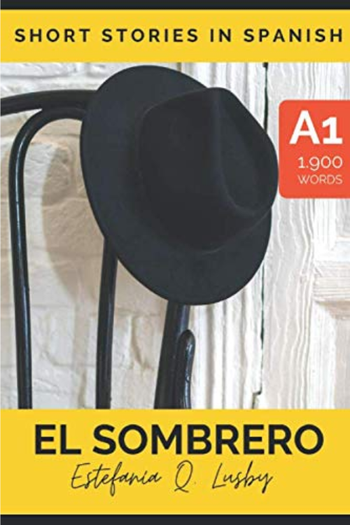{:  style="display: block; margin: 0 auto; max-width:50%; height:auto;" }

#### _¡Hola, Lola!_ của Juan Fernandez

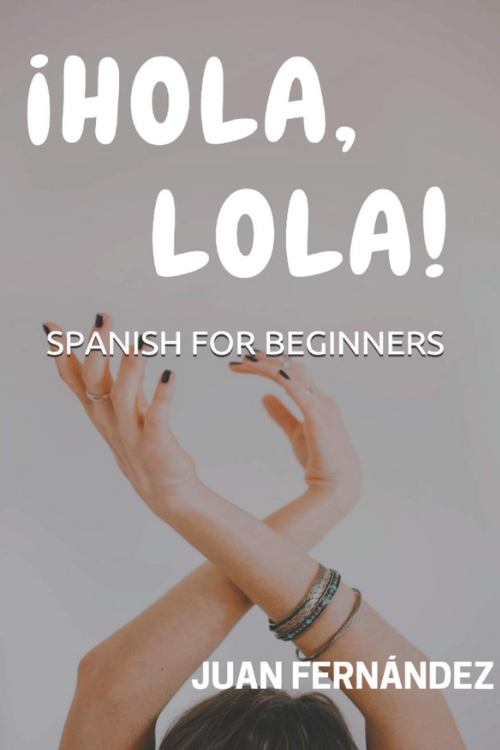{:  style="display: block; margin: 0 auto; max-width:50%; height:auto;" }

#### _Una aventura de WhatsApp_ của María Danader

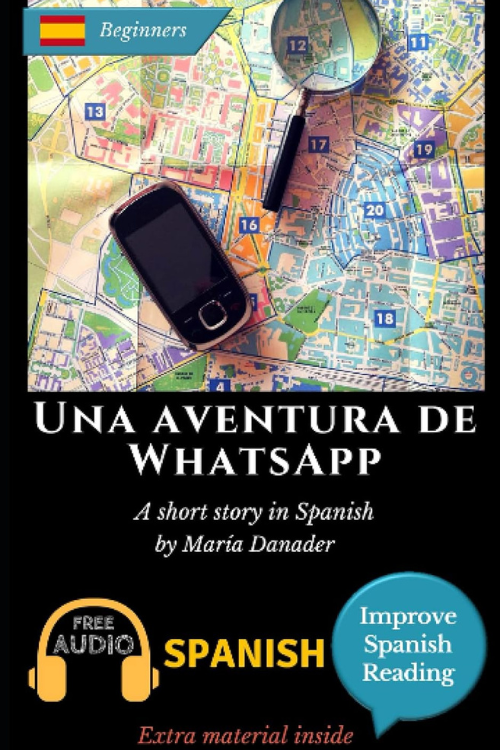{:  style="display: block; margin: 0 auto; max-width:50%; height:auto;" }

#### _Viaje a Madrid_ của Cristina López

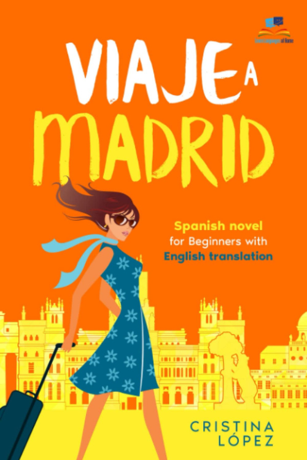{:  style="display: block; margin: 0 auto; max-width:50%; height:auto;" }

### A2

Nếu bạn đã vượt qua phần cơ bản và muốn tăng “sức bền”, sách A2 là cây cầu hoàn hảo. Chúng đủ thử thách mà không quá tải, và đưa bạn tiếp xúc với câu dài hơn.

Người học yêu thích **La profe de español** và **Año nuevo, vida nueva** của Juan Fernández nhờ hội thoại tự nhiên, hoặc **Enigma en la Playa** của María Danader nếu bạn thích trinh thám nhẹ.

Một số tác phẩm gợi ý bao gồm:

#### *La chica del bar* của Estefanía Quevedo

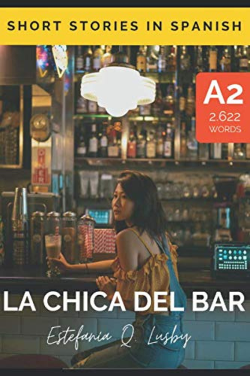{:  style="display: block; margin: 0 auto; max-width:50%; height:auto;" }

#### *La profe de español* của Juan Fernández

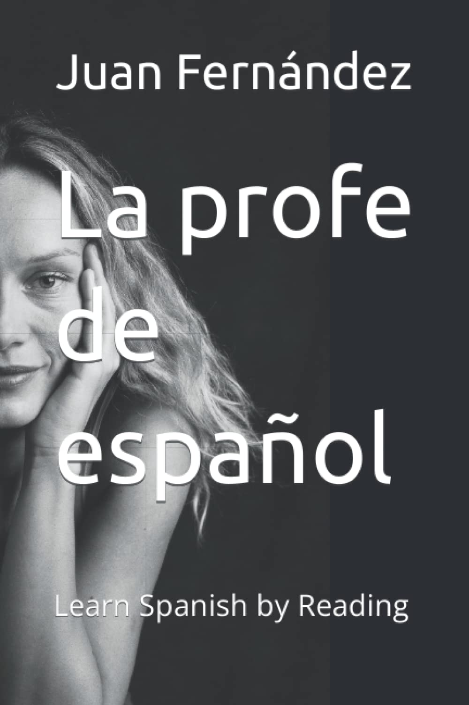{:  style="display: block; margin: 0 auto; max-width:50%; height:auto;" }

#### *Año nuevo, vida nueva* của Juan Fernández

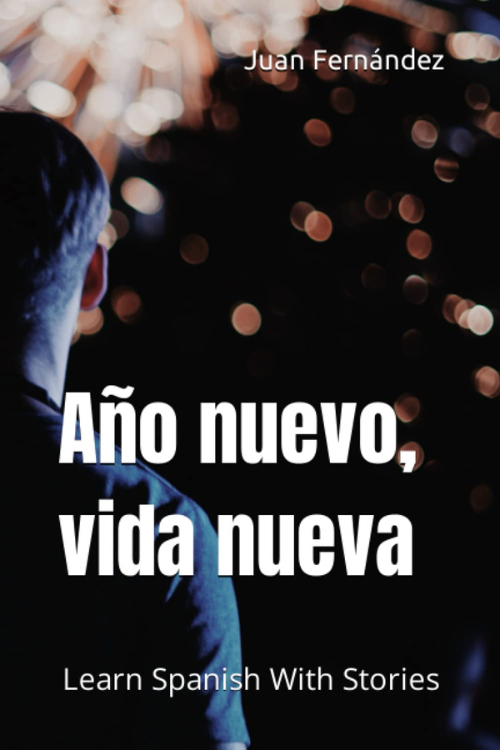{:  style="display: block; margin: 0 auto; max-width:50%; height:auto;" }

### B1–B2

Ở trình độ trung cấp, mục tiêu là đạt độ trôi chảy thông qua _đọc mở rộng_ (extensive reading), đọc nhiều hơn và dịch ít hơn. Những cuốn sách này mở rộng vốn từ, củng cố ngữ pháp và giúp bạn tiếp xúc với nhiều giọng điệu và bối cảnh văn hóa khác nhau.

Một số cuốn tôi yêu thích gồm **¿Me voy o me quedo?** của Juan Fernández, **Misterio en la Biblioteca** của María Danader, và bộ **Short Stories in Spanish** của Olly Richards.

Một số tác phẩm gợi ý bao gồm:

#### *¿Me voy o me quedo?* - của Juan Fernández.

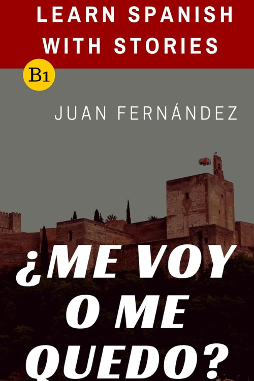{:  style="display: block; margin: 0 auto; max-width:50%; height:auto;" }

#### *Misterio en la biblioteca*: của María Danader 

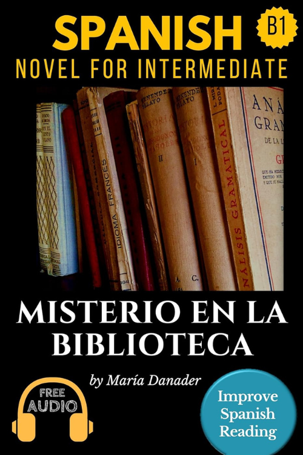{:  style="display: block; margin: 0 auto; max-width:50%; height:auto;" }

#### Un café en Buenos Aires: Una aventura con sabor a tango của Estefanía Quevedo Lusby 

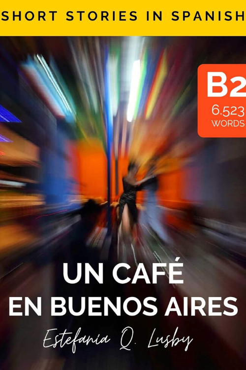{:  style="display: block; margin: 0 auto; max-width:50%; height:auto;" }

#### Sobreviví (6-book series) của Lauren Tarshis

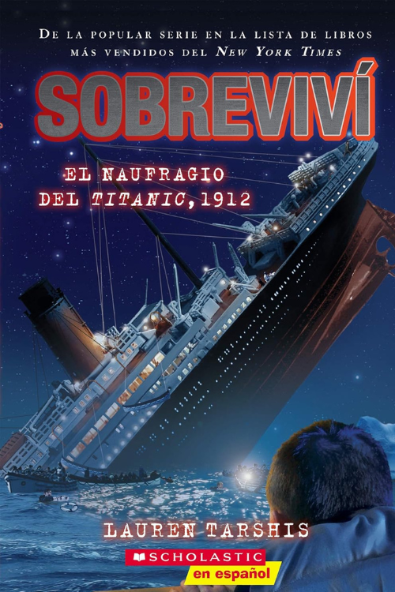{:  style="display: block; margin: 0 auto; max-width:50%; height:auto;" }

### Tiểu thuyết thật

Khi bạn đã thoải mái với việc đọc tiếng Tây Ban Nha nguyên bản, đã đến lúc chuyển sang **nội dung thật**.

Dưới đây là danh sách đã được **bổ sung mô tả ngắn, dễ hiểu, tập trung vào nội dung và “cảm giác đọc”** cho từng tác phẩm, để bạn dễ chọn theo sở thích:

#### _Como agua para chocolate_ – Laura Esquivel

Tiểu thuyết pha trộn giữa lãng mạn và hiện thực huyền ảo, xoay quanh một gia đình Mexico nơi cảm xúc của nhân vật được truyền qua các món ăn. Văn phong giàu hình ảnh, nhiều từ vựng về đời sống, ẩm thực và cảm xúc.

#### Carlos Ruiz Zafón – _La sombra del viento_ (The Shadow of the Wind)

Một thiếu niên khám phá một cuốn sách bí ẩn và lần theo cuộc đời của tác giả bị lãng quên. Không khí huyền bí, u ám, đậm chất Barcelona hậu chiến. Phù hợp nếu bạn thích trinh thám, văn học và bầu không khí cổ điển.

#### Carlos Ruiz Zafón – _Marina_

Câu chuyện trưởng thành pha yếu tố kinh dị nhẹ và lãng mạn, về một chàng trai trẻ và cô gái bí ẩn tên Marina. Ngôn ngữ giàu cảm xúc, nhiều đoạn miêu tả, dễ cuốn.

#### Carlos Ruiz Zafón – _El príncipe de la niebla_

Tiểu thuyết dành cho thanh thiếu niên, mang màu sắc huyền bí và phiêu lưu. Nội dung xoay quanh một gia đình chuyển đến thị trấn ven biển và phát hiện những bí mật đen tối. Ngắn, dễ theo dõi.

#### Juan Gómez-Jurado – _Reina Roja_

Trinh thám – giật gân hiện đại về một nữ thiên tài điều tra và một cảnh sát bất đắc dĩ. Nhịp nhanh, nhiều hội thoại, phù hợp để luyện tiếng Tây Ban Nha đương đại.

#### Juan Gómez-Jurado – _El Emblema del traidor_

Tiểu thuyết hành động – lịch sử, xoay quanh gián điệp, âm mưu và danh tính. Có yếu tố quốc tế, nhiều tình tiết gay cấn.

### Một số tác phẩm khác

### _La Casa en Mango Street_ – Sandra Cisneros

Tập hợp các mẩu truyện ngắn về tuổi thơ và cuộc sống của một bé gái gốc Mexico ở Mỹ. Câu văn ngắn, đơn giản, giàu cảm xúc, rất phù hợp cho người học.

#### _El Principito_ – Antoine de Saint-Exupéry

Câu chuyện triết lý nhẹ nhàng về một hoàng tử nhỏ du hành qua các hành tinh. Ngôn ngữ đơn giản nhưng sâu sắc, dễ đọc và nổi tiếng toàn thế giới.

#### _El diario de Ana Frank_

Nhật ký của một cô bé Do Thái trốn phát xít trong Thế chiến II. Văn phong chân thật, cảm xúc, giúp bạn tiếp xúc với tiếng Tây Ban Nha tự sự.

#### **El Túnel – Ernesto Sabato**

Tiểu thuyết tâm lý u ám về một họa sĩ ám ảnh và mối tình dẫn đến bi kịch. Câu văn ngắn, nhưng ý nghĩa sâu và nhiều độc thoại nội tâm.

#### _Delirio_ – Laura Restrepo

Câu chuyện về một người phụ nữ rơi vào trạng thái loạn trí và người chồng tìm hiểu nguyên nhân. Đan xen giữa tâm lý cá nhân và bối cảnh xã hội Colombia.

#### _La casa de los espíritus_ – Isabel Allende

Biên niên sử nhiều thế hệ của một gia đình Chile, pha trộn lịch sử và hiện thực huyền ảo. Nhiều nhân vật, nhiều tuyến truyện, giàu văn hóa Mỹ Latin.

#### _El Último Catón_ – Matilde Asensi

Phiêu lưu – trinh thám xoay quanh Vatican, mật mã và các thử thách cổ xưa. Phù hợp nếu bạn thích kiểu truyện giống _The Da Vinci Code_.

#### _El coronel no tiene quien le escriba_ – Gabriel García Márquez

Câu chuyện ngắn về một vị đại tá già chờ đợi lá thư hứa hẹn lương hưu không bao giờ đến. Giản dị, buồn, giàu tính biểu tượng.

#### _El amor en tiempos de cólera_ – Gabriel García Márquez

Câu chuyện tình kéo dài hàng chục năm, khám phá các dạng tình yêu, hôn nhân và cô đơn. Văn phong đẹp, nhiều ẩn dụ.

#### _Cien años de soledad_ – Gabriel García Márquez

Biên niên sử huyền ảo của dòng họ Buendía qua nhiều thế hệ. Nhiều nhân vật trùng tên, cấu trúc phức tạp, nhưng rất giàu giá trị văn học.

#### _El Alquimista_ – Paulo Coelho

Hành trình của một cậu bé chăn cừu đi tìm kho báu và khám phá ước mơ đời mình. Ngôn ngữ tương đối đơn giản, mang tính triết lý.

## Các câu hỏi khác

### Nếu tôi không hiểu hết mọi thứ mình đọc thì sao?

Cảm giác đó là bình thường, và thực ra nó là một phần của quá trình.
Hầu hết người học nản chí vì nghĩ rằng họ phải hiểu từng từ. Nhưng khả năng hiểu tăng lên thông qua _ngữ cảnh_, không phải qua việc dịch từng chữ.
Hãy tập trung vào ý chính, gạch chân các cụm quan trọng, rồi tiếp tục đọc. Mỗi lần đọc sẽ giúp bạn củng cố khả năng nhận ra các mẫu câu.

**Và hãy nhớ: ngay cả người bản ngữ cũng không biết mọi từ trong mọi cuốn sách.**

Khi chúng ta đọc tiểu thuyết hay sách phi hư cấu bằng tiếng Anh, thực tế chúng ta cũng không hiểu từng từ. Nhưng bộ não sẽ tự lấp đầy các khoảng trống. Vậy điều đó có nghĩa gì khi bạn đọc tiếng Tây Ban Nha?

Mục tiêu là sự tự tin, không phải sự hoàn hảo.

### Mất bao lâu trước khi tôi có thể đọc sách tiếng Tây Ban Nha một cách thoải mái?

Nếu bạn chỉ đọc 10–15 phút mỗi ngày, bạn có thể nhận thấy tiến bộ trong vài tuần.
Sau một hoặc hai cuốn sách ngắn, bạn sẽ bắt đầu nhận ra các cấu trúc quen thuộc và ngừng dịch trong đầu.
Sau 3–4 cuốn sách, não bạn sẽ bắt đầu đoán trước ý nghĩa trước khi bạn đọc đến cuối câu: đó là lúc tiếng Tây Ban Nha bắt đầu “vỡ ra”.

Sự đều đặn quan trọng hơn cường độ. Một chương mỗi tuần tốt hơn một cuối tuần nhồi nhét.

### Cách tốt nhất để chọn cuốn sách tiếng Tây Ban Nha tiếp theo là gì?

Hãy chọn một cuốn sách **chỉ khó vừa đủ** — nơi bạn hiểu khoảng 60% văn bản mà không cần từ điển.
Nếu bạn phải liên tục dừng lại tra từ, sách đó quá khó; nếu bạn không bao giờ phải dừng, sách đó quá dễ.
Trên hết, hãy chọn một câu chuyện _khiến bạn hứng thú_. Bạn sẽ học được nhiều hơn từ một cuốn sách bạn yêu thích so với một cuốn bạn nghĩ là “nên” đọc.

## Tóm tắt: Những điều bạn học được hôm nay

- **Đọc tiếng Tây Ban Nha là mắt xích còn thiếu** giữa việc biết từ vựng và sử dụng chúng một cách tự nhiên trong hội thoại.
- Bạn không cần hiểu mọi thứ — hãy tập trung vào ý nghĩa, không phải sự hoàn hảo.
- Bắt đầu với **sách phân cấp theo trình độ (graded readers)** hoặc truyện ngắn, rồi dần chuyển sang tiểu thuyết nguyên bản.
- **Kết hợp đọc với viết hoặc thảo luận** để từ mới “bám” lâu hơn.
- Xây dựng thói quen đọc hằng ngày **10–15 phút** — đó là nơi “phép màu” xảy ra.

Việc đọc đã trở thành vũ khí bí mật của tôi trong hành trình học tiếng Tây Ban Nha khi trưởng thành.

Và tôi luôn nhớ điều đó mỗi khi tự làm mình ngạc nhiên với khả năng tiếng Tây Ban Nha của mình — dù là sắp xếp hoa cho tiệc cưới ở Thành phố Mexico hay có một cuộc trò chuyện tuyệt vời với chị dâu của tôi.

## Tham khảo

- [Hướng dẫn đọc Tiếng Tây Ban Nha của spanishwithdominique](https://spanishwithdominique.com/blog/reading-in-spanish-ultimate-guide)
- [I’ve Read Dozens of Spanish Books - These Are the Best for Beginners](https://spanishwithdominique.com/blog/best-books-to-read-to-learn-spanish-as-a-beginner)
- [My Top 7 Book Recommendations for A2 Spanish Readers](https://spanishwithdominique.com/blog/spanish-books-for-beginners-a2)
- [Intermediate Spanish Reading: 7 Fun Books For Fluency](https://spanishwithdominique.com/blog/intermediate-spanish-reading)
- Và rất nhiều các gợi ý đơn lẻ trên Reddit khác mà mình tìm được.